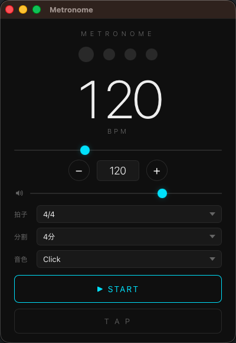

# Metronome

A macOS desktop metronome app that plays click sounds at a precise tempo with real-time beat visualization.



---

## Requirements

| | |
|---|---|
| OS | macOS (Apple Silicon / Intel) |
| Python | 3.10+ |
| GUI | pywebview 4.4+ |

## Installation

```bash
pip install -r requirements.txt
```

## Running

### App bundle (distribution)

Double-click `dist/Metronome.app`.

### From Python (development)

```bash
python -m metronome
```

## Features

| Feature | Details |
|---|---|
| BPM | 30–300 BPM via slider, numeric input, or +/− buttons |
| Time signature | 2/4, 3/4, 4/4, 6/8 (default: 4/4) |
| Tap tempo | Tap the TAP button repeatedly to calculate BPM from the last 8 intervals |
| Subdivision | Quarter, 8th, triplet, 16th |
| Sound | Beep / Click / Wood presets |
| Volume | 0–100% (default: 70%) |
| Beat indicator | Current beat highlighted in cyan in real time |

## Keyboard Shortcuts

| Key | Action |
|---|---|
| `Space` / `Enter` | Play / Stop |
| `↑` / `↓` | BPM +1 / −1 |
| `T` | Tap tempo |

## Project Structure

```
Metronome/
├── metronome/
│   ├── app.py       # Window setup and pywebview config
│   ├── api.py       # Python API callable from JavaScript
│   ├── engine.py    # Metronome timing engine
│   └── audio.py     # Synthesized sound generation and playback
├── ui/
│   ├── index.html
│   ├── style.css
│   └── app.js
├── dist/
│   └── Metronome.app
├── requirements.txt
└── README.md
```

## Building the App Bundle

The `dist/` directory is not included in this repository. Run the build script to create `Metronome.app` locally:

```bash
bash build.sh
```

This creates `dist/Metronome.app` — a self-contained macOS app bundle. You can then move it to `/Applications` or distribute it directly.

**What the script does:**

1. Creates the `.app` bundle structure under `dist/`
2. Writes `Contents/Info.plist` with app metadata
3. Generates a launcher shell script in `Contents/MacOS/`
4. Copies `metronome/` and `ui/` source files into `Contents/Resources/`
5. Installs Python dependencies (`requirements.txt`) into the bundle via `pip`

> The bundle uses whichever `python3` is on your `PATH`. Python 3.10+ is required.

## Tests

```bash
pytest
```
